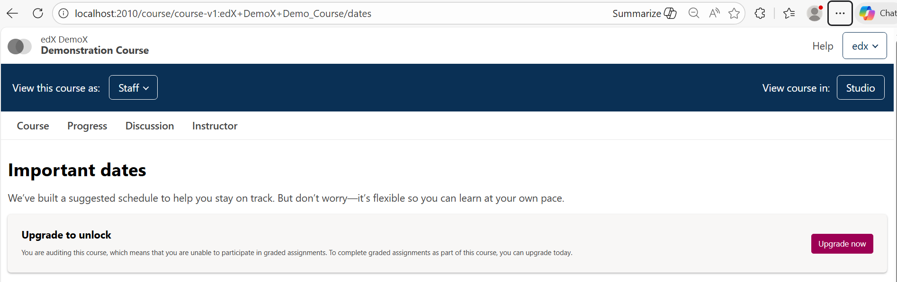

# Banner Dates Upgrade Slot

### Slot ID: `org.openedx.frontend.learning.banner_dates_upgrade.v1`

## Description

This slot is used for rendering upgrade messaging in the dates tab banner area.

By default, the slot renders `UpgradeToCompleteAlert`. You can disable the default and fully replace it with a custom plugin experience using `keepDefault: false`.

## Props

- `courseId` - The course ID (string)
- `logUpgradeLinkClick` - Callback used for upgrade-click analytics

## Screenshots

Default banner screenshot:




## Example

The following `env.config.jsx` example replaces the default banner experience with a custom plugin widget:

```js
import {
  DIRECT_PLUGIN,
  PLUGIN_OPERATIONS,
} from '@openedx/frontend-plugin-framework';

const config = {
  pluginSlots: {
    'org.openedx.frontend.learning.banner_dates_upgrade.v1': {
      keepDefault: false,
      plugins: [
        {
          op: PLUGIN_OPERATIONS.Insert,
          widget: {
            id: 'org.openedx.frontend.learning.custom_banner_dates_upgrade_widget.v1',
            type: DIRECT_PLUGIN,
            priority: 50,
            RenderWidget: (pluginProps) => (
              <div>
                Replacement Banner
                <button>Upgrade here</button>
              </div>
            ),
          },
        },
      ],
    },
  },
};

export default config;
```
