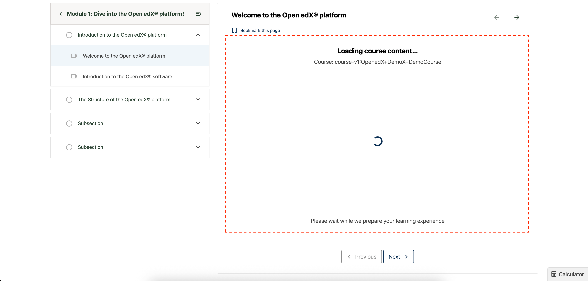

# Content IFrame Loader Slot

### Slot ID: `org.openedx.frontend.learning.content_iframe_loader.v1`

### Slot ID Aliases
* `content_iframe_loader_slot`

### Props:
* `courseId` - String identifier for the current course
* `defaultLoaderComponent` - React component used as the default loading indicator

## Description

This slot is used to customize the loading indicator displayed while course content is being loaded in an iframe. It appears when content is loading but hasn't fully rendered yet, providing a customizable loading experience for learners.

The default implementation shows a `PageLoading` component with a screen reader message.

## Example

The following `env.config.jsx` will replace the default loading spinner with a custom loading component that shows the course ID and a custom message.




```js
import { DIRECT_PLUGIN, PLUGIN_OPERATIONS } from '@openedx/frontend-plugin-framework';

const config = {
  pluginSlots: {
    'org.openedx.frontend.learning.content_iframe_loader.v1': {
      plugins: [
        {
          op: PLUGIN_OPERATIONS.Insert,
          widgetId: 'default_contents',
          widget: {
            id: 'custom_iframe_loader',
            type: DIRECT_PLUGIN,
            RenderWidget: ({ courseId, defaultLoaderComponent }) => (
              <div style={{ textAlign: 'center', padding: '2rem' }}>
                <h3>Loading course content...</h3>
                <p>Course: {courseId}</p>
                <div style={{ margin: '1rem 0' }}>
                  {defaultLoaderComponent}
                </div>
                <p>Please wait while we prepare your learning experience</p>
              </div>
            ),
          },
        },
      ]
    }
  },
}

export default config;
```
