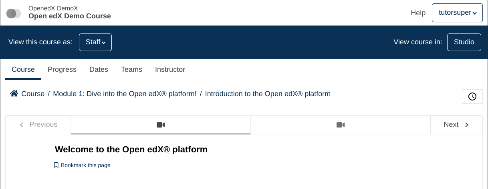

# Course Breadcrumbs Slot

### Slot ID: `org.openedx.frontend.learning.course_breadcrumbs.v2`

### Slot ID Aliases
* `course_breadcrumbs_slot`

## Description

This slot is used to replace/modify/hide the course breadcrumbs.

## Example

### Default content


### Replace with default breadcrumbs component
You can also inject the default `CourseBreadcrumbs` component explicitly using the slot system, for example to wrap or style it differently.


```js
import { DIRECT_PLUGIN, PLUGIN_OPERATIONS } from '@openedx/frontend-plugin-framework';

import CourseBreadcrumbs from './src/courseware/course/breadcrumbs';

const config = {
  pluginSlots: {
    'org.openedx.frontend.learning.course_breadcrumbs.v2': {
      keepDefault: false,
      plugins: [
        {
          op: PLUGIN_OPERATIONS.Insert,
          widget: {
            id: 'default_breadcrumbs_component',
            type: DIRECT_PLUGIN,
            RenderWidget: ({ courseId, sectionId, sequenceId, isStaff, unitId }) => (
              <CourseBreadcrumbs
                courseId={courseId}
                sectionId={sectionId}
                sequenceId={sequenceId}
                isStaff={isStaff}
                unitId={unitId}
              />
            ),
          },
        },
      ]
    }
  },
}

export default config;
```

### Replaced with custom component


The following `env.config.jsx` will replace the course breadcrumbs entirely.

```js
import { DIRECT_PLUGIN, PLUGIN_OPERATIONS } from '@openedx/frontend-plugin-framework';

const config = {
  pluginSlots: {
    'org.openedx.frontend.learning.course_breadcrumbs.v2': {
      keepDefault: false,
      plugins: [
        {
          op: PLUGIN_OPERATIONS.Insert,
          widget: {
            id: 'custom_breadcrumbs_component',
            type: DIRECT_PLUGIN,
            RenderWidget: () => (
              <h1>🍞</h1>
            ),
          },
        },
      ]
    }
  },
}

export default config;
```

## Version Notes

- `v2`: Removed default slot content.
