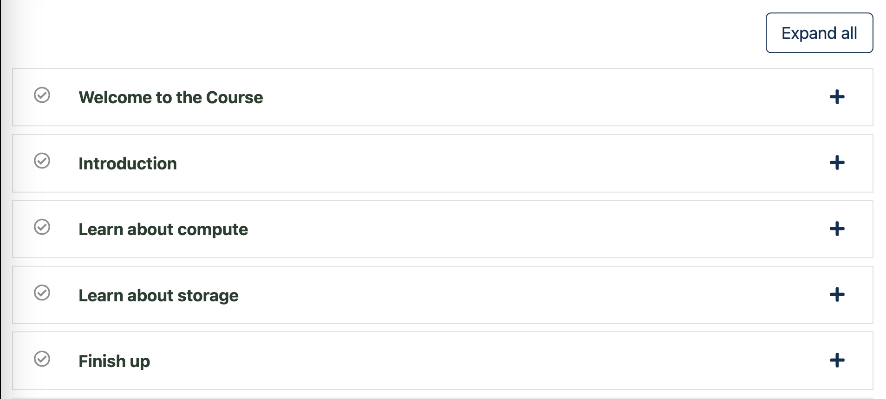
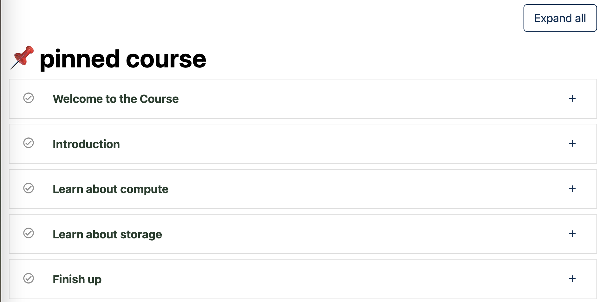

# Course Home Section Outline Slot

### Slot ID: `org.openedx.frontend.learning.course_home_section_outline.v1`

### Slot ID Aliases
* `course_home_section_outline_slot`

## Description

This slot is used to replace/modify/hide the course home section outline.

## Example

### Default content


### Added with custom component


The following `env.config.jsx` will replace the course home section outline entirely.

```js
import { DIRECT_PLUGIN, PLUGIN_OPERATIONS } from '@openedx/frontend-plugin-framework';
import Section from '@src/course-home/outline-tab/section-outline/Section';

const config = {
  pluginSlots: {
    'org.openedx.frontend.learning.course_home_section_outline.v1': {
      keepDefault: false,
      plugins: [
        {
          op: PLUGIN_OPERATIONS.Insert,
          widget: {
            id: 'custom_section_outline_component',
            type: DIRECT_PLUGIN,
            RenderWidget: (props) => (
              <>
                <h1 className="d-xl-none">📌</h1>
                <ol id="courseHome-outline" className="list-unstyled">
                  {props.sectionIds.map((sectionId) => (
                    <Section
                      key={props.sectionId}
                      defaultOpen={props.sections[sectionId].resumeBlock}
                      expand={props.expandAll}
                      section={props.sections[sectionId]}
                    />
                  ))}
                </ol>
              </>
            ),
          },
        },
      ]
    }
  },
}

export default config;
```
