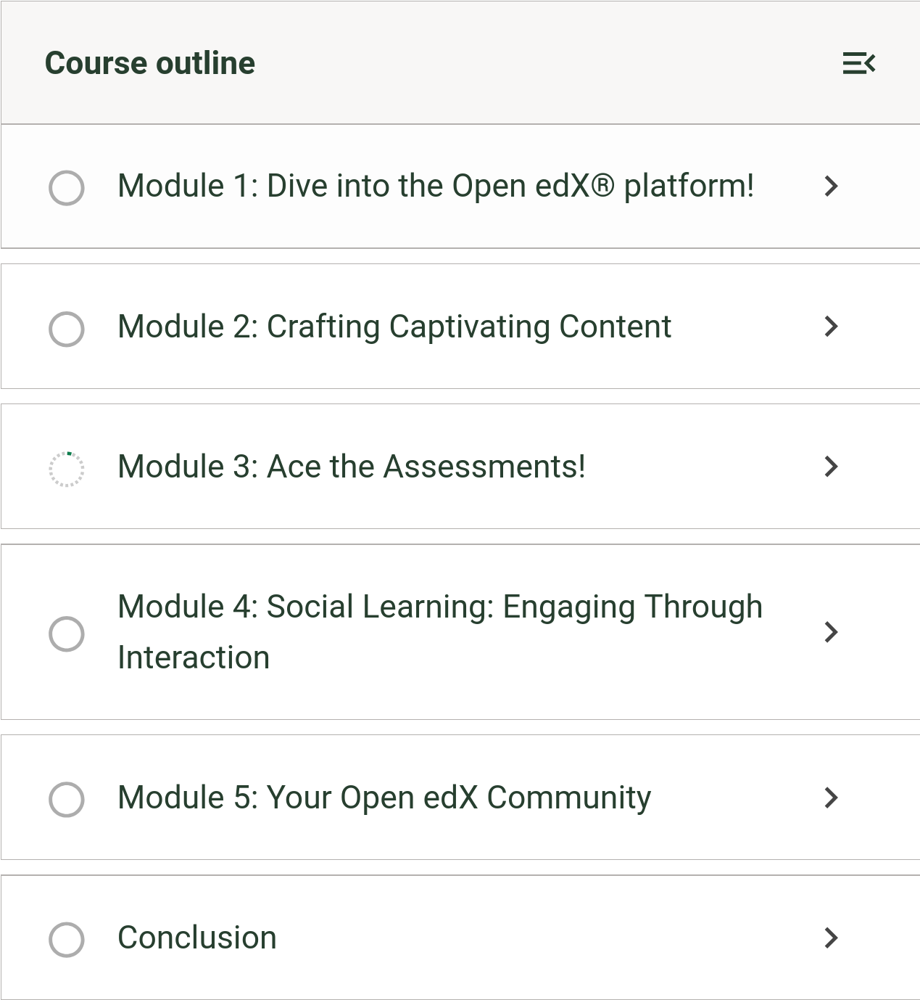

# Course Outline Sidebar Completion Icon Slot

### Slot ID: `org.openedx.frontend.learning.course_outline_sidebar_completion_icon.v1`

## Description

This slot is used to replace/modify/hide the completion icon for both sections and sequences in the course outline sidebar. The `variant` prop indicates where the icon is being rendered, so a single plugin can render differently for sections and sequences.

### Props:
* `completionStat: { completed, total }`: Object containing the completion status of the section or sequence
* `enabled`: Boolean indicating if completion tracking is enabled
* `active`: Boolean indicating if the section or sequence is currently active
* `variant`: Either `'section'` or `'sequence'`, indicating where the icon is being rendered

Because this slot is shared by both sections and sequences, branch on `variant` to decide what to render at each location. The examples below customize one location at a time and leave the other (`null` is returned for the unmatched `variant`).

## Examples

### Unmodified Course Outline


### Section: replaced with a custom component


The following `env.config.jsx` will replace the course outline sidebar completion icon for sections with a custom component.

```js
import { DIRECT_PLUGIN, PLUGIN_OPERATIONS } from '@openedx/frontend-plugin-framework';
import { Bubble } from '@openedx/paragon';
import { CompletionIcon } from '@src/courseware/course/sidebar/sidebars/course-outline/components/CompletionIcon';


const config = {
  pluginSlots: {
    'org.openedx.frontend.learning.course_outline_sidebar_completion_icon.v1': {
      keepDefault: false,
      plugins: [
        {
          op: PLUGIN_OPERATIONS.Insert,
          widget: {
            id: 'custom_icon',
            type: DIRECT_PLUGIN,
            RenderWidget: ({completionStat, enabled, active, variant}) => (
              variant === 'section' ? (
                <Bubble variant={active ? 'success' : 'primary'}>
                  {enabled && <>{completionStat.completed}/{completionStat.total}</>}
                </Bubble>
              ) : <CompletionIcon completionStat={completionStat} enabled={enabled} />
            ),
          },
        },
      ]
    }
  },
}

export default config;
```

### Sequence: replaced with a custom component


The following `env.config.jsx` will replace the course outline sidebar completion icon for sequences with a custom component.

```js
import { DIRECT_PLUGIN, PLUGIN_OPERATIONS } from '@openedx/frontend-plugin-framework';
import { Bubble } from '@openedx/paragon';
import { CompletionIcon } from '@src/courseware/course/sidebar/sidebars/course-outline/components/CompletionIcon';

const config = {
  pluginSlots: {
    'org.openedx.frontend.learning.course_outline_sidebar_completion_icon.v1': {
      keepDefault: false,
      plugins: [
        {
          op: PLUGIN_OPERATIONS.Insert,
          widget: {
            id: 'custom_icon',
            type: DIRECT_PLUGIN,
            RenderWidget: ({completionStat, enabled, active, variant}) => (
              variant === 'sequence' ? (
                <Bubble variant={active ? 'success' : 'primary'}>
                  {enabled && <>{completionStat.completed}/{completionStat.total}</>}
                </Bubble>
              ) : <CompletionIcon completionStat={completionStat} enabled={enabled} />
            ),
          },
        },
      ]
    }
  },
}

export default config;
```
