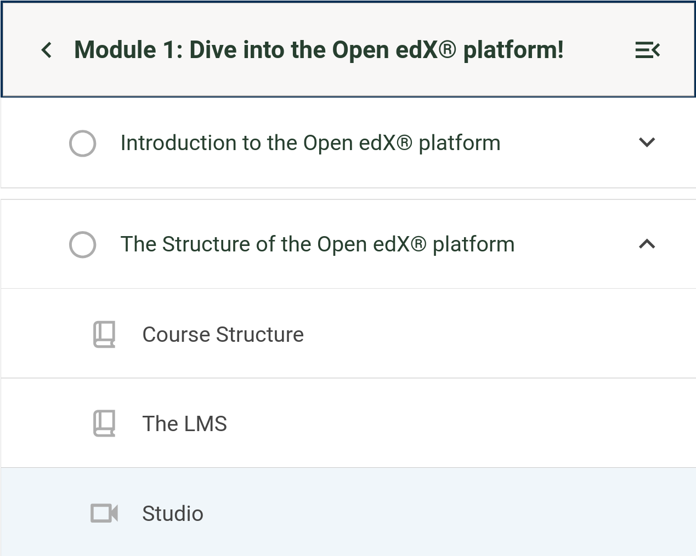

# Course Outline Sidebar Heading Slot

### Slot ID: `org.openedx.frontend.learning.course_outline_sidebar_heading.v1`

## Description

This slot is used to replace/modify/hide the heading for sections in the course outline sidebar.

### Props:
- `onToggleCollapse`: Function to toggle the collapse state of the section.
- `isSequenceLevel`: Boolean indicating if the section is a sequence level.
- `title`: The title of the section.
- `onClickBack`: Function to call when the back button is clicked.

## Example

### Wrapped with a border


The following `env.config.jsx` will wrap the default heading with a border.

```js
import { PLUGIN_OPERATIONS } from '@openedx/frontend-plugin-framework';

const config = {
  pluginSlots: {
    'org.openedx.frontend.learning.course_outline_sidebar_heading.v1': {
      keepDefault: true,
      plugins: [
        {
          op: PLUGIN_OPERATIONS.Wrap,
          widgetId: 'default_contents',
          wrapper: ({ component }) => (
            <div style={{ border: '2px solid var(--pgn-color-primary-base)' }}>
              {component}
            </div>
          ),
        },
      ],
    },
  },
};

export default config;

```
