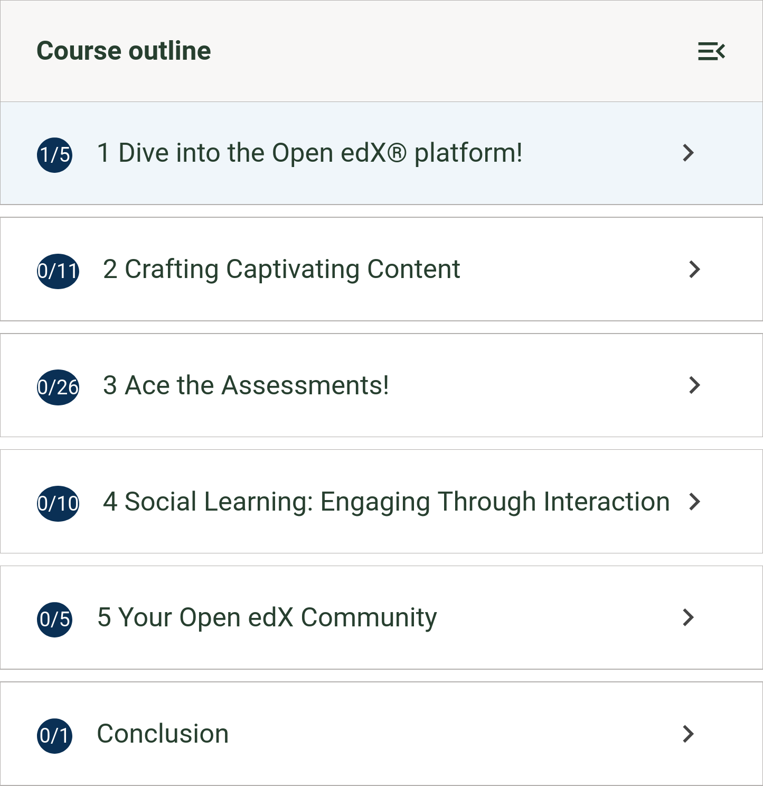

# Course Outline Sidebar Section Completion Icon Slot

### Slot ID: `org.openedx.frontend.learning.course_outline_sidebar_section_completion_icon.v1`

## Description

This slot is used to replace/modify/hide the completion icon for sections in the course outline sidebar.

### Props:
* `completionStat: { completed, total }`: Object containing the completion status of the section
* `enabled`: Boolean indicating if completion tracking is enabled for the section

## Example

### Replaced with a custom component


The following `env.config.jsx` will replace the course outline sidebar section completion icon with a custom component.

```js
import { DIRECT_PLUGIN, PLUGIN_OPERATIONS } from '@openedx/frontend-plugin-framework';
import { Bubble } from '@openedx/paragon';


const config = {
  pluginSlots: {
    'org.openedx.frontend.learning.course_outline_sidebar_section_completion_icon.v1': {
      keepDefault: false,
      plugins: [
        {
          op: PLUGIN_OPERATIONS.Insert,
          widget: {
            id: 'custom_icon',
            type: DIRECT_PLUGIN,
            RenderWidget: ({completionStat, enabled}) => (
              <Bubble>
                {completionStat.completed}/{completionStat.total}
              </Bubble>
            ),
          },
        },
      ]
    }
  },
}

export default config;
```
