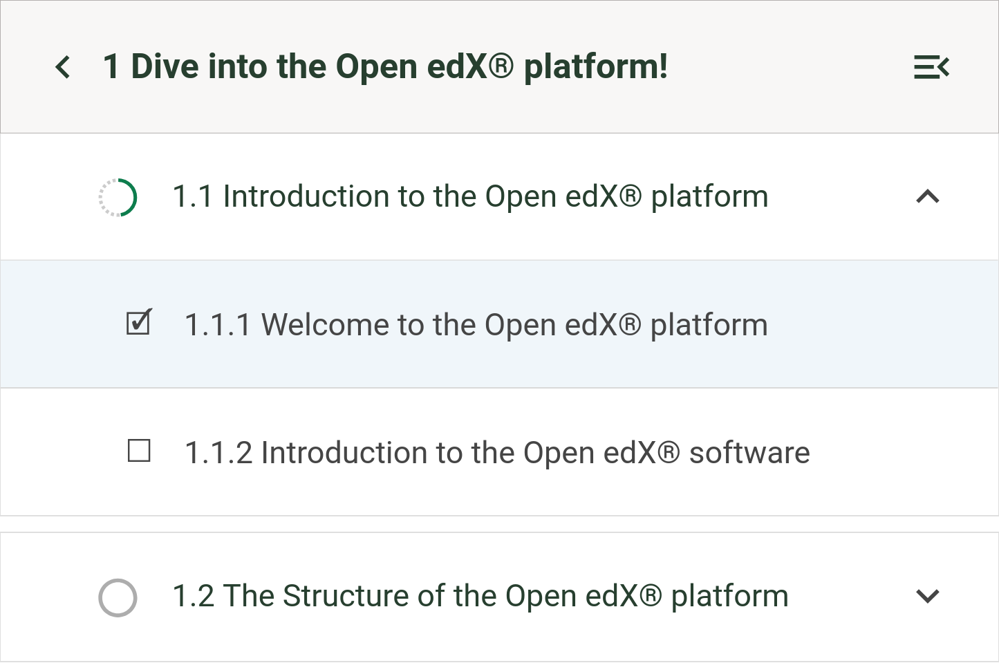

# Course Outline Sidebar Unit Icon Slot

### Slot ID: `org.openedx.frontend.learning.course_outline_sidebar_unit_icon.v1`

### Props:
* `type`: The type of the unit.
* `isCompleted`: Whether the unit is completed.

## Description

This slot is used to replace/modify/hide the unit icon in the course outline sidebar.

## Example

### Replaced Unit Icon


The following `env.config.jsx` will replace the unit icon with a custom icon.

```jsx
import { DIRECT_PLUGIN, PLUGIN_OPERATIONS } from '@openedx/frontend-plugin-framework';

const config = {
  pluginSlots: {
    'org.openedx.frontend.learning.course_outline_sidebar_unit_icon.v1': {
      keepDefault: true,
      plugins: [
        {
          op: PLUGIN_OPERATIONS.Insert,
          widget: {
            id: 'custom_unit_icon',
            type: DIRECT_PLUGIN,
            RenderWidget: ({isCompleted}) => (isCompleted ? '🗹' : '☐'),
          },
        },
      ],
    },
  },
};

export default config;
```
