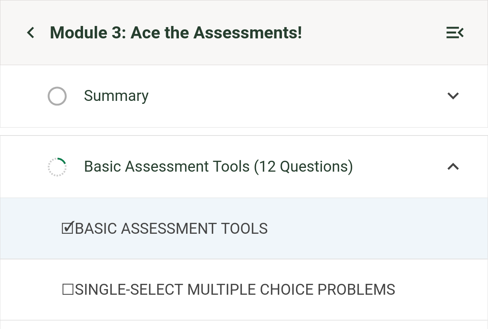

# Course Outline Sidebar Unit Slot

### Slot ID: `org.openedx.frontend.learning.course_outline_sidebar_unit.v1`

### Props:

- `unit`: The unit object, including its `title`, `icon`, `complete` status,
  etc.
- `isLocked`: Whether the unit is locked.
- `isCompletionTrackingEnabled`: Whether completion tracking is enabled.
- `icon`: The unit icon component.

## Description

This slot is used to replace/modify/hide the contents of an individual unit in
the course outline sidebar. The contents are rendered inside the unit's
navigation link, so the slot replaces what is shown for the unit (such as its
icon and title) while keeping the link and list-item wrapper intact.

## Example

### Replaced Unit



The following `env.config.jsx` will replace the unit contents with a simple
emoji indicating whether the unit is locked, complete, or incomplete.

```jsx
import {
  DIRECT_PLUGIN,
  PLUGIN_OPERATIONS,
} from '@openedx/frontend-plugin-framework';

const config = {
  pluginSlots: {
    'org.openedx.frontend.learning.course_outline_sidebar_unit.v1': {
      keepDefault: false,
      plugins: [
        {
          op: PLUGIN_OPERATIONS.Insert,
          widget: {
            id: 'custom_unit',
            type: DIRECT_PLUGIN,
            RenderWidget: ({ unit, isLocked, isCompletionTrackingEnabled }) => {
              let unitStatus = '';
              if (isLocked) {
                unitStatus = '🔒';
              } else if (isCompletionTrackingEnabled) {
                unitStatus = unit.complete ? '🗹' : '☐';
              }
              return (
                <span>
                  {unitStatus}
                  {unit.title.toUpperCase()}
                </span>
              );
            },
          },
        },
      ],
    },
  },
};

export default config;
```
