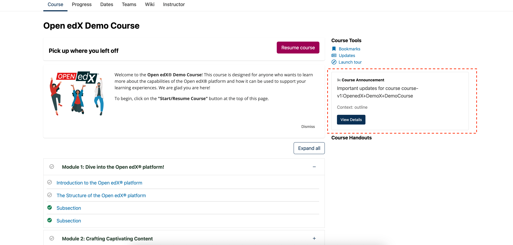

# Course Outline Tab Notifications Slot

### Slot ID: `org.openedx.frontend.learning.course_outline_tab_notifications.v1`

### Slot ID Aliases
* `outline_tab_notifications_slot`

### Props:
* `courseId` - String identifier for the current course
* `model` - String indicating the context model (set to 'outline')

## Description

This slot is used to add custom notification components to the course outline tab sidebar. It appears in the right sidebar of the course outline/home tab, positioned between the Course Tools widget and the Course Dates widget.

The slot provides a flexible way to inject custom notifications, announcements, or informational components that are contextually relevant to the course outline view.

## Example

The following `env.config.jsx` will add a custom notification component to the course outline tab sidebar.



```js
import { DIRECT_PLUGIN, PLUGIN_OPERATIONS } from '@openedx/frontend-plugin-framework';

const config = {
  pluginSlots: {
    'org.openedx.frontend.learning.course_outline_tab_notifications.v1': {
      plugins: [
        {
          op: PLUGIN_OPERATIONS.Insert,
          widget: {
            id: 'custom_outline_notification',
            type: DIRECT_PLUGIN,
            RenderWidget: ({ courseId, model }) => (
              <div className="card mb-3">
                <div className="card-body">
                  <h5 className="card-title">📢 Course Announcement</h5>
                  <p className="card-text">
                    Important updates for course {courseId}
                  </p>
                  <p className="text-muted small">
                    Context: {model}
                  </p>
                  <button className="btn btn-primary btn-sm">
                    View Details
                  </button>
                </div>
              </div>
            ),
          },
        },
      ]
    }
  },
}

export default config;
```
