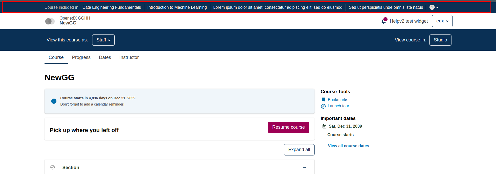
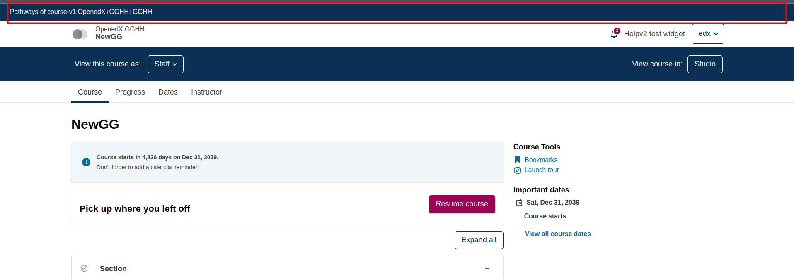

# Course Pathways Strip Slot

### Slot ID: `org.openedx.frontend.learning.course_pathways_strip.v1`

### Props:
* `courseId` - String identifier for the current course

## Description

This slot is used to replace/modify/hide the strip shown above the course header, which lists the pathways
that include the current course and in which the learner is enrolled. When the pathways do not fit in the
strip, the remaining ones are shown in a "+N" popover. The default strip is not rendered when the course is
not included in any of the learner's pathways.

## Example

### Default content


### Replaced with a custom strip


The following `env.config.jsx` will replace the default strip with a custom one.

```js
import { DIRECT_PLUGIN, PLUGIN_OPERATIONS } from '@openedx/frontend-plugin-framework';

const config = {
  pluginSlots: {
    'org.openedx.frontend.learning.course_pathways_strip.v1': {
      keepDefault: false,
      plugins: [
        {
          op: PLUGIN_OPERATIONS.Insert,
          widget: {
            id: 'custom_course_pathways_strip',
            type: DIRECT_PLUGIN,
            RenderWidget: ({ courseId }) => (
              <div className="bg-primary text-white small py-2 px-4">
                Pathways of {courseId}
              </div>
            ),
          },
        },
      ],
    },
  },
};

export default config;
```

To hide the strip, use `PLUGIN_OPERATIONS.Hide` with `widgetId: 'default_contents'`.
