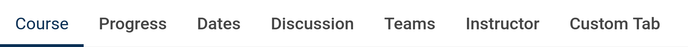

# Course Tab Links Slot

### Slot ID: `org.openedx.frontend.learning.course_tab_links.v1`

### Props:
* `activeTabSlug`: The slug of the currently active tab.

## Description

This slot is used to replace/modify/hide the course tabs.

## Example

### Added link to Course Tabs


The following `env.config.jsx` will add a new course tab call "Custom Tab".

```js
import { DIRECT_PLUGIN, PLUGIN_OPERATIONS } from '@openedx/frontend-plugin-framework';

import { CourseTabLink } from '@src/course-tabs/CourseTabLink';


const config = {
  pluginSlots: {
    "org.openedx.frontend.learning.course_tab_links.v1": {
      keepDefault: true,
      plugins: [
        {
          op: PLUGIN_OPERATIONS.Insert,
          widget: {
            id: 'custom_tab',
            type: DIRECT_PLUGIN,
            RenderWidget: ({ activeTabSlug })=> (
              <CourseTabLink
                url="/some/path"
                slug="custom-link"
                title="Custom Tab"
                activeTabSlug={activeTabSlug}
              />
            ),
          },
        },
      ],
    },
  },
}

export default config;
```
