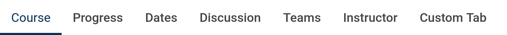

# Course Tab Links Slot

### Slot ID: `org.openedx.frontend.learning.course_tab_links.v1`

## Description

This slot is used to replace/modify/hide the course tabs.

## Example

### Added link to Course Tabs


The following `env.config.jsx` will add a new course tab call "Custom Tab".

```js
import { DIRECT_PLUGIN, PLUGIN_OPERATIONS } from '@openedx/frontend-plugin-framework';

const config = {
  pluginSlots: {
    "org.openedx.frontend.learning.course_tab_links.v1": {
      keepDefault: true,
      plugins: [
        {
          op: PLUGIN_OPERATIONS.Insert,
          widget: {
            id: 'custom_tab',
            type: DIRECT_PLUGIN,
            RenderWidget: ()=> (
              <a
                className={classNames('nav-item flex-shrink-0 nav-link')}
                href="#"
              >
                Custom Tab
              </a>
            ),
          },
        },
      ],
    },
  },
}

export default config;
```
