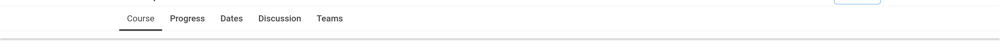

# Course Tab Navigation Slot

### Slot ID: `org.openedx.frontend.learning.course_tab_navigation.v1`

### Props:
NONE

## Description

This slot is used to replace/modify/hide the entire course tab navigation.

## Example

### Added a drop shadow to Course Tabs bar


The following `env.config.jsx` will add a new course tab call "Custom Tab".

```js
import { DIRECT_PLUGIN, PLUGIN_OPERATIONS } from '@openedx/frontend-plugin-framework';

const config = {
  pluginSlots: {
    "org.openedx.frontend.learning.course_tab_navigation.v1": {
      keepDefault: true,
      plugins: [
        {
          op: PLUGIN_OPERATIONS.Wrap,
          widgetId: 'default_contents',
          wrapper: ({component}) => (<div class="shadow">{component}</div>)
        },
      ],
    },
  },
}

export default config;
```
