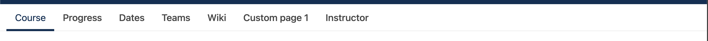

# Course Tab Navigation Slot

### Slot ID: `org.openedx.frontend.learning.course_tabs_navigation.v1`

### Props:
* `showNavbar` (boolean, default: `true`) — Controls the visibility of the entire navigation bar (tab links + search button).
* `showSearchButton` (boolean, default: `true`) — Controls the visibility of the search toggle button independently.

## Description

This slot is used to replace/modify/hide the entire course tab navigation. The `showNavbar` and `showSearchButton` props can be overridden via `PLUGIN_OPERATIONS.Modify` to selectively hide parts of the navigation without replacing the whole slot.

## Examples

### Added a drop shadow to Course Tabs bar


The following `env.config.jsx` will wrap the course tabs navigation with a drop shadow.

```js
import { PLUGIN_OPERATIONS } from '@openedx/frontend-plugin-framework';

const config = {
  pluginSlots: {
    "org.openedx.frontend.learning.course_tabs_navigation.v1": {
      keepDefault: true,
      plugins: [
        {
          op: PLUGIN_OPERATIONS.Wrap,
          widgetId: 'default_contents',
          wrapper: ({ component }) => (<div className="shadow">{component}</div>)
        },
      ],
    },
  },
}

export default config;
```

### Hide the navigation bar

The following `env.config.jsx` will hide the tab links and search button while keeping the CoursewareSearch dialog functional.

```js
import { PLUGIN_OPERATIONS } from '@openedx/frontend-plugin-framework';

const config = {
  pluginSlots: {
    "org.openedx.frontend.learning.course_tabs_navigation.v1": {
      keepDefault: true,
      plugins: [
        {
          op: PLUGIN_OPERATIONS.Modify,
          widgetId: 'default_contents',
          fn: (widget) => {
            widget.content = { showNavbar: false };
            return widget;
          }
        },
      ],
    },
  },
}

export default config;
```

### Hide only the search button

The following `env.config.jsx` will hide the search toggle button but keep the tab links visible.



```js
import { PLUGIN_OPERATIONS } from '@openedx/frontend-plugin-framework';

const config = {
  pluginSlots: {
    "org.openedx.frontend.learning.course_tabs_navigation.v1": {
      keepDefault: true,
      plugins: [
        {
          op: PLUGIN_OPERATIONS.Modify,
          widgetId: 'default_contents',
          fn: (widget) => {
            widget.content = { showSearchButton: false };
            return widget;
          }
        },
      ],
    },
  },
}

export default config;
```
