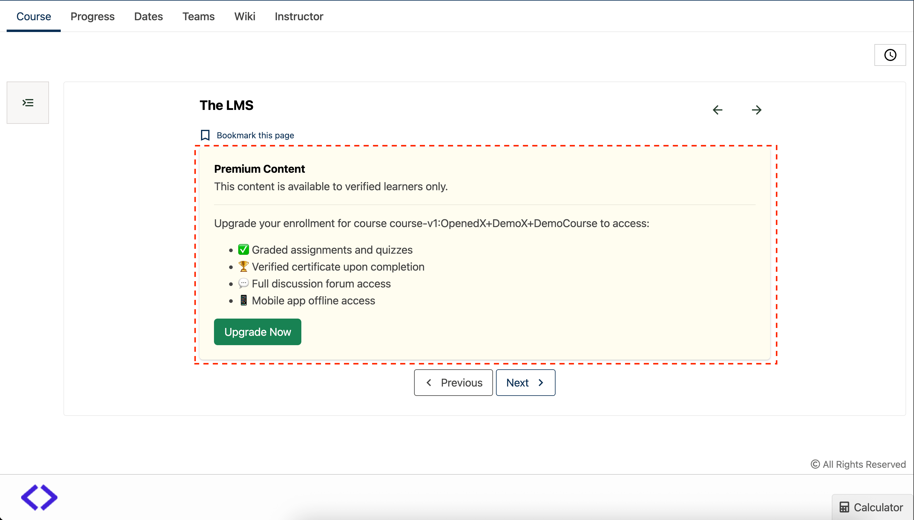

# Gated Unit Content Message Slot

### Slot ID: `org.openedx.frontend.learning.gated_unit_content_message.v1`

### Slot ID Aliases
* `gated_unit_content_message_slot`

### Props:
* `courseId` - String identifier for the current course

## Description

This slot is used to customize the message displayed when course content is gated or locked for learners who haven't upgraded to a verified track. It appears when a unit contains content that requires a paid enrollment (such as graded assignments) and the learner is on the audit track.

The default implementation shows a `LockPaywall` component that displays an upgrade message with benefits of upgrading, including access to graded assignments, certificates, and full course features.

This slot is conditionally rendered only when `contentTypeGatingEnabled` is true and the unit `containsContentTypeGatedContent`.

## Example

The following `env.config.jsx` will replace the default paywall message with a custom gated content component.



```js
import { DIRECT_PLUGIN, PLUGIN_OPERATIONS } from '@openedx/frontend-plugin-framework';

const config = {
  pluginSlots: {
    'org.openedx.frontend.learning.gated_unit_content_message.v1': {
      plugins: [
        {
          op: PLUGIN_OPERATIONS.Insert,
          widgetId: 'default_contents',
          widget: {
            id: 'custom_gated_message',
            type: DIRECT_PLUGIN,
            RenderWidget: ({ courseId }) => (
              <div className="alert alert-warning" role="alert">
                <div className="d-flex align-items-center mb-3">
                  <i className="fa fa-lock fa-2x me-3" aria-hidden="true"></i>
                  <div>
                    <h4 className="alert-heading mb-1">Premium Content</h4>
                    <p className="mb-0">This content is available to verified learners only.</p>
                  </div>
                </div>
                <hr />
                <p className="mb-3">
                  Upgrade your enrollment for course {courseId} to access:
                </p>
                <ul className="mb-3">
                  <li>✅ Graded assignments and quizzes</li>
                  <li>🏆 Verified certificate upon completion</li>
                  <li>💬 Full discussion forum access</li>
                  <li>📱 Mobile app offline access</li>
                </ul>
                <button className="btn btn-success">
                  Upgrade Now
                </button>
              </div>
            ),
          },
        },
      ]
    }
  },
}

export default config;
```
