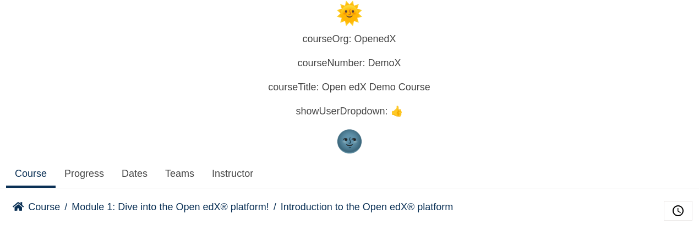

# Header Slot

### Slot ID: `org.openedx.frontend.layout.header_learning.v1`

### Slot ID Aliases
* `header_slot`

### Props:
* `courseOrg`
* `courseNumber`
* `courseTitle`
* `showUserDropdown`

## Description

This slot is used to replace/modify/hide the entire learning header.

## Example

The following `env.config.jsx` will replace the learning header entirely.



```js
import { DIRECT_PLUGIN, PLUGIN_OPERATIONS } from '@openedx/frontend-plugin-framework';

const config = {
  pluginSlots: {
    'org.openedx.frontend.layout.header_learning.v1': {
      keepDefault: false,
      plugins: [
        {
          op: PLUGIN_OPERATIONS.Insert,
          widget: {
            id: 'custom_header_component',
            type: DIRECT_PLUGIN,
            RenderWidget: ({courseOrg, courseNumber, courseTitle, showUserDropdown}) => (
              <>
                <h1 style={{textAlign: 'center'}}>🌞</h1>
                <p style={{textAlign: 'center'}}>courseOrg: {courseOrg}</p>
                <p style={{textAlign: 'center'}}>courseNumber: {courseNumber}</p>
                <p style={{textAlign: 'center'}}>courseTitle: {courseTitle}</p>
                <p style={{textAlign: 'center'}}>showUserDropdown: {showUserDropdown ? '👍' : '👎'}</p>
                <h1 style={{textAlign: 'center'}}>🌚</h1>
              </>
            ),
          },
        },
      ]
    }
  },
}

export default config;
```
