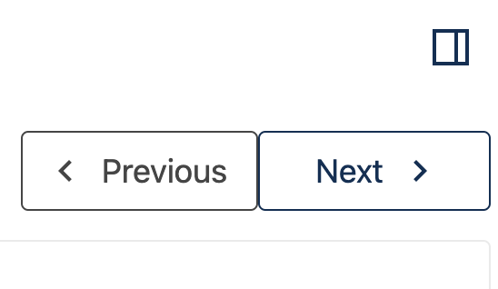
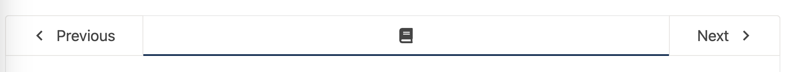
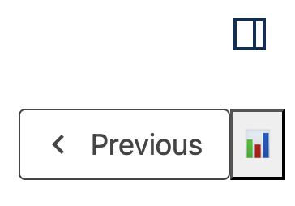
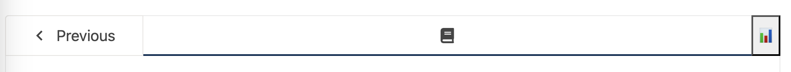

# Next Unit Top Navigation Trigger Slot

### Slot ID: `org.openedx.frontend.learning.next_unit_top_nav_trigger.v1`

### Slot ID Aliases
* `next_unit_top_nav_trigger_slot`

## Description

This slot is used to replace/modify/hide the next button used for unit and sequence navigation at the top of the unit page.

## Example

### Default content

**Next unit button in at top for left sidebar navigation**


**Next unit button in horizontal navigation**


### Replaced with custom component

**Next unit button in at top for left sidebar navigation**


**Next unit button in horizontal navigation**



The following `env.config.jsx` will replace the next unit/sequence button at the top of the unit page. This can be used control the
button's `onClick` atrribute or change the name of the button.

```js
import { DIRECT_PLUGIN, PLUGIN_OPERATIONS } from '@openedx/frontend-plugin-framework';

const config = {
  pluginSlots: {
    'org.openedx.frontend.learning.next_unit_top_nav_trigger.v1': {
      keepDefault: false,
      plugins: [
        {
          op: PLUGIN_OPERATIONS.Insert,
          widget: {
            id: 'custom_button_component',
            type: DIRECT_PLUGIN,
            RenderWidget: () => (
              <button>📊</button>
            ),
          },
        },
      ]
    }
  },
}

export default config;
```
