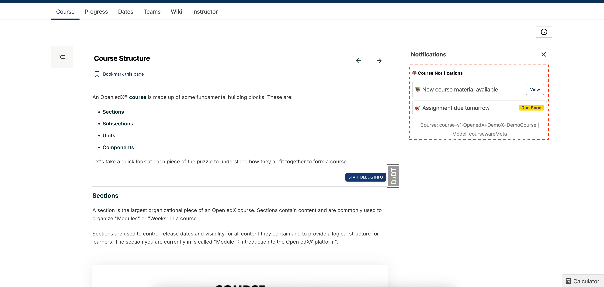

# Notification Tray Slot

### Slot ID: `org.openedx.frontend.learning.notification_tray.v1`

### Slot ID Aliases
* `notification_tray_slot`

### Props:
* `courseId` - String identifier for the current course
* `model` - String indicating the context model (set to 'coursewareMeta')
* `notificationCurrentState` - Current state of upgrade notifications (UpgradeNotificationState)
* `setNotificationCurrentState` - Function to update the notification state

## Description

This slot is used to customize the notification tray that appears in the courseware sidebar. The notification tray displays upgrade-related notifications and alerts for learners in verified mode courses. It provides a way to show contextual notifications about course access, deadlines, and upgrade opportunities.

The slot is conditionally rendered only for learners in verified mode courses. For non-verified courses, a simple "no notifications" message is displayed instead.

The `notificationCurrentState` can be one of: `'accessLastHour'`, `'accessHoursLeft'`, `'accessDaysLeft'`, `'FPDdaysLeft'`, `'FPDLastHour'`, `'accessDateView'`, or `'PastExpirationDate'`.

## Example

The following `env.config.jsx` will customize the notification tray with additional notification types and styling.


```js
import { DIRECT_PLUGIN, PLUGIN_OPERATIONS } from '@openedx/frontend-plugin-framework';

const config = {
  pluginSlots: {
    'org.openedx.frontend.learning.notification_tray.v1': {
      plugins: [
        {
          // Insert custom notification content
          op: PLUGIN_OPERATIONS.Replace,
          widget: {
            id: 'custom_notifications',
            type: DIRECT_PLUGIN,
            RenderWidget: ({ 
              courseId, 
              model, 
              notificationCurrentState, 
              setNotificationCurrentState 
            }) => (
              <div className="p-3">
                <h5 className="mb-3">📬 Course Notifications</h5>
                
                {notificationCurrentState === 'accessLastHour' && (
                  <div className="alert alert-warning mb-3">
                    <strong>⏰ Last Chance!</strong>
                    <p className="mb-0">Your access expires in less than an hour.</p>
                  </div>
                )}
                
                {notificationCurrentState === 'accessDaysLeft' && (
                  <div className="alert alert-info mb-3">
                    <strong>📅 Access Reminder</strong>
                    <p className="mb-0">Your course access expires in a few days.</p>
                  </div>
                )}
                
                <div className="notification-item p-2 mb-2 border rounded">
                  <div className="d-flex justify-content-between align-items-center">
                    <span>📚 New course material available</span>
                    <button 
                      className="btn btn-sm btn-outline-primary"
                      onClick={() => setNotificationCurrentState('accessDateView')}
                    >
                      View
                    </button>
                  </div>
                </div>
                
                <div className="notification-item p-2 mb-2 border rounded">
                  <div className="d-flex justify-content-between align-items-center">
                    <span>🎯 Assignment due tomorrow</span>
                    <span className="badge bg-warning">Due Soon</span>
                  </div>
                </div>
                
                <div className="text-center mt-3">
                  <small className="text-muted">
                    Course: {courseId} | Model: {model}
                  </small>
                </div>
              </div>
            ),
          },
        },
      ]
    }
  },
}

export default config;
```
