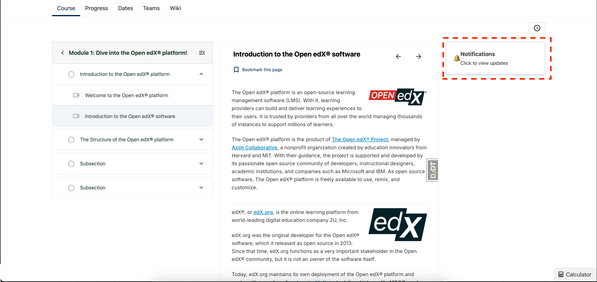

# Notification Widget Slot

### Slot ID: `org.openedx.frontend.learning.notification_widget.v1`

### Slot ID Aliases
* `notification_widget_slot`

### Props:
* `courseId` - String identifier for the current course
* `model` - String indicating the context model (set to 'coursewareMeta')
* `notificationCurrentState` - Current state of upgrade notifications (UpgradeNotificationState)
* `setNotificationCurrentState` - Function to update the notification state
* `toggleSidebar` - Function to toggle the sidebar open/closed

## Description

This slot is used to customize the notification widget that appears in the discussions-notifications sidebar. The widget is displayed as a compact notification component that shows upgrade-related alerts and can trigger the full notification tray when clicked.

The widget appears in the combined discussions-notifications sidebar and is conditionally rendered based on the `hideNotificationbar` and `isNotificationbarAvailable` flags. It automatically tracks user engagement and calls `onNotificationSeen` after a 3-second timeout.

The `notificationCurrentState` can be one of: `'accessLastHour'`, `'accessHoursLeft'`, `'accessDaysLeft'`, `'FPDdaysLeft'`, `'FPDLastHour'`, `'accessDateView'`, or `'PastExpirationDate'`.

## Example

The following `env.config.jsx` will customize the notification widget with a more interactive design and additional functionality.



```js
import { DIRECT_PLUGIN, PLUGIN_OPERATIONS } from '@openedx/frontend-plugin-framework';

const NotificationWidget = ({
  courseId,
  model,
  notificationCurrentState,
  setNotificationCurrentState,
  toggleSidebar
}) => {
  const getNotificationContent = () => {
    switch (notificationCurrentState) {
      case 'accessLastHour':
        return {
          icon: '⚠️',
          title: 'Final Hour!',
          message: 'Access expires in less than 1 hour',
          variant: 'danger'
        };
      case 'accessHoursLeft':
        return {
          icon: '⏰',
          title: 'Expiring Soon',
          message: 'Access expires in a few hours',
          variant: 'warning'
        };
      case 'accessDaysLeft':
        return {
          icon: '📅',
          title: 'Access Reminder',
          message: 'Access expires in a few days',
          variant: 'info'
        };
      case 'FPDdaysLeft':
      case 'FPDLastHour':
        return {
          icon: '🎯',
          title: 'Upgrade Available',
          message: 'Get full access to premium features',
          variant: 'primary'
        };
      default:
        return {
          icon: '🔔',
          title: 'Notifications',
          message: 'Click to view updates',
          variant: 'secondary'
        };
    }
  };

  const notification = getNotificationContent();

  return (
    <div
      className={`alert alert-${notification.variant} mb-0 cursor-pointer`}
      onClick={toggleSidebar}
      role="button"
      tabIndex={0}
      onKeyDown={(e) => {
        if (e.key === 'Enter' || e.key === ' ') {
          e.preventDefault();
          toggleSidebar();
        }
      }}
    >
      <div className="d-flex align-items-center">
        <span className="me-2" style={{ fontSize: '1.2em' }}>
          {notification.icon}
        </span>
        <div className="flex-fill">
          <strong className="d-block">{notification.title}</strong>
          <small>{notification.message}</small>
        </div>
        <div className="ms-2">
          <i className="fa fa-chevron-right" aria-hidden="true"></i>
        </div>
      </div>
    </div>
  );
}

const config = {
  pluginSlots: {
    'org.openedx.frontend.learning.notification_widget.v1': {
      plugins: [
        {
          op: PLUGIN_OPERATIONS.Insert,
          widgetId: 'default_contents',
          widget: {
            id: 'custom_notification_widget',
            type: DIRECT_PLUGIN,
            RenderWidget: NotificationWidget
          },
        },
      ]
    }
  },
}

export default config;
```
