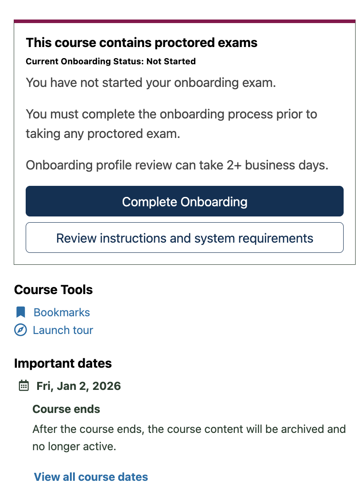
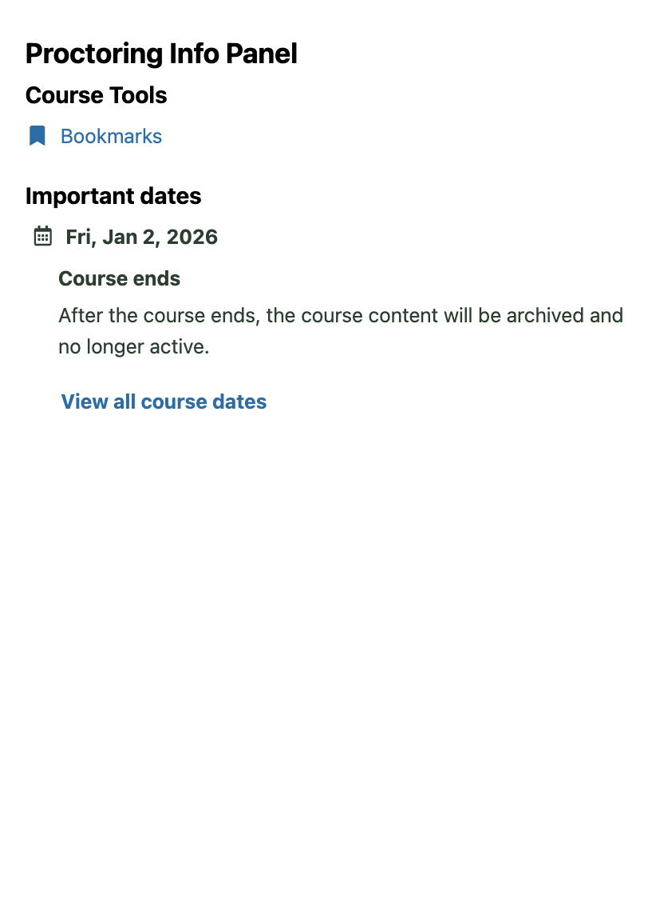

# Procotoring Info Panel Slot

### Slot ID: `org.openedx.frontend.learning.proctoring_info_panel.v1`

### Slot ID Aliases
* `proctoring_info_panel_slot`

### Props:
* `proctoringReviewRequirementsButtonLink`

## Description

This slot is used to replace/modify/hide the proctoring info panel.

## Example

### Default content


### Replaced with custom component


The following `env.config.jsx` will replace the notifications discussions sidebar.

```js
import { DIRECT_PLUGIN, PLUGIN_OPERATIONS } from '@openedx/frontend-plugin-framework';

const config = {
  pluginSlots: {
    'org.openedx.frontend.learning.proctoring_info_panel.v1': {
      keepDefault: false,
      plugins: [
            {
                op: PLUGIN_OPERATIONS.Insert,
                widget: {
                id: 'proctoring_info_panel',
                type: DIRECT_PLUGIN,
                RenderWidget: () => <h3>Proctoring Info Panel</h3>,
                },
            },
        ],
    }
  },
}

export default config;
```
