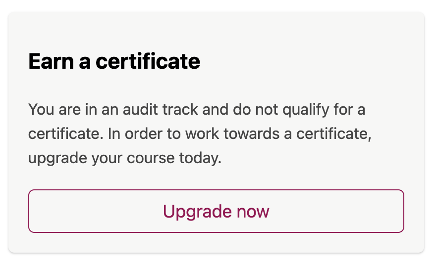
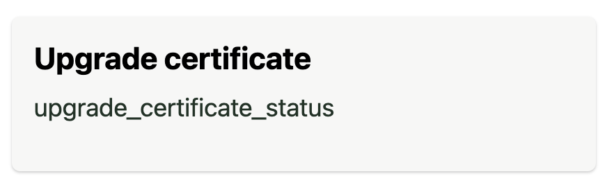

# Progress Certificate Status Slot

### Slot ID: `org.openedx.frontend.learning.progress_certificate_status.v1`

### Slot ID Aliases
* `progress_certificate_status_slot`

### Props:
* `courseId`

## Description

This slot is used for modify the content in the CertificateStatus in the progress page for specific enrollment tracks.

## Example

The following `env.config.jsx` will render the `RenderWidget.props.id` of the course as `<p>` element.

### Default content


### Replaced with custom component


```js
import { DIRECT_PLUGIN, PLUGIN_OPERATIONS } from '@openedx/frontend-plugin-framework';

const modifyWidget = (widget) => {
  const { RenderWidget } = widget;
  if (RenderWidget.props.id.includes('upgrade')) {
    widget.RenderWidget = (
      <div className='m-3'>
        <h3>Upgrade certificate</h3>
        <p>{RenderWidget.props.id}</p>
      </div>
    )
  }
  
  return widget;
}

const config = {
  pluginSlots: {
    'org.openedx.frontend.learning.progress_certificate_status.v1': {
      keepDefault: true,
      plugins: [{
        op: PLUGIN_OPERATIONS.Modify,
        widgetId: 'default_contents',
        // Insert custom content top modify certificate status
        fn: modifyWidget,
      }],
    }
  },
}

export default config;
```
