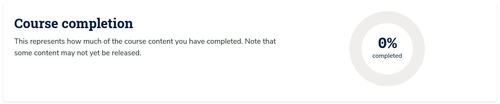
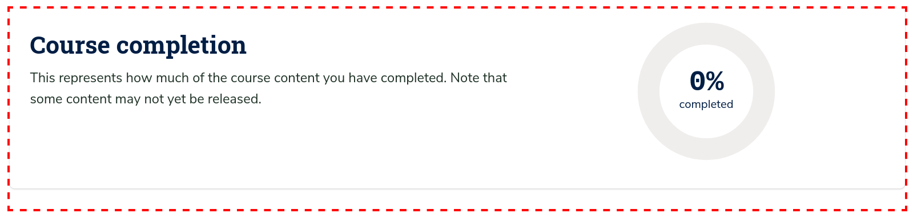

# Progress Tab Course Completion Slot

### Slot ID: `org.openedx.frontend.learning.progress_tab_course_completion.v1`

### Props:
* `enableProgressGraph` — Boolean flag that indicated whether the progress graph is enabled for the coruse.

## Description

This slot is used to replace or modify the Course Completion chart view in the Progress Tab.

## Example

The following `env.config.jsx` will render a dashed border around the course completion chart component.




```jsx
import { PLUGIN_OPERATIONS } from '@openedx/frontend-plugin-framework';

const config = {
  pluginSlots: {
    'org.openedx.frontend.learning.progress_tab_course_completion.v1': {
      keepDefault: true,
      plugins: [
        {
          op: PLUGIN_OPERATIONS.Wrap,
          widgetId: 'default_contents',
          wrapper: ({ component }) => (
            <div style={{ border: '3px dashed red' }}>
              {component}
            </div>
          ),
        },
      ],
    },
  },
}

export default config;
```
