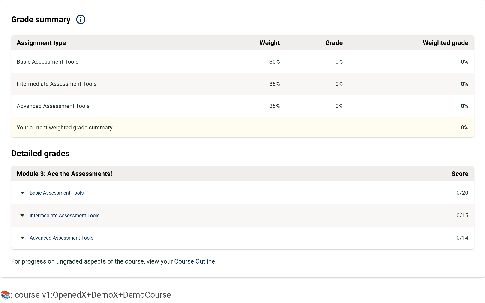

# Progress Tab Grade Breakdown Slot

### Slot ID: `progress_tab_grade_breakdown_slot`
### Props:

## Description

This slot is used to replace or modify the Grade Summary and Details Breakdown view in the Progress Tab.

## Example

The following `env.config.jsx` will render the `course_id` of the course as a `<p>` element in a `<div>`.



```js
import { DIRECT_PLUGIN, PLUGIN_OPERATIONS } from '@openedx/frontend-plugin-framework';
import { useContextId } from './src/data/hooks';

const config = {
  pluginSlots: {
    progress_tab_grade_breakdown_slot: {
      plugins: [
        {
          // Insert custom content after grade summary widget
          op: PLUGIN_OPERATIONS.Insert,
          widget: {
            id: 'custom_grade_summary_content',
            type: DIRECT_PLUGIN,
            RenderWidget: () => {
              const courseId = useContextId();
              return (
                <div>
                  <p>📚: {courseId}</p>
                </div>
              );
            },
          },
        },
      ]
    }
  },
}

export default config;
```
