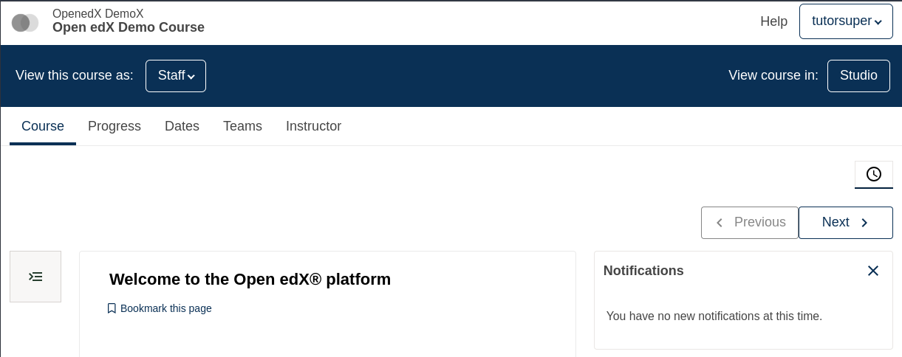
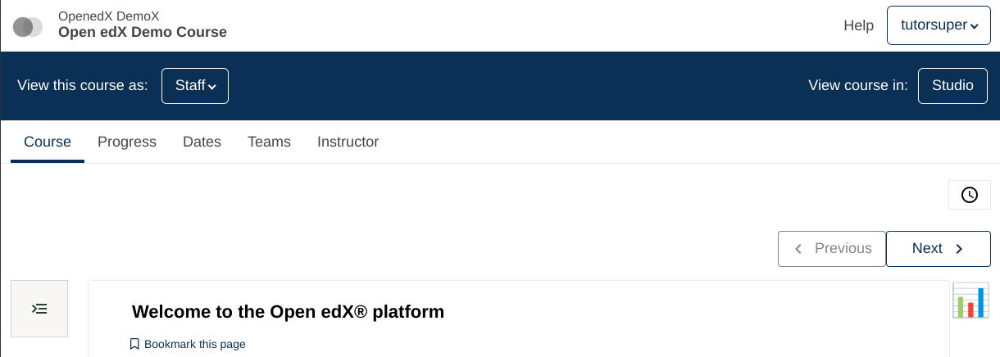

# Right Sidebar Slot

### Slot ID: `org.openedx.frontend.learning.right_sidebar.v1`

### Slot ID Aliases
* `right_sidebar_slot`

## Description

This slot is used to replace/modify/hide the right sidebar (discussions and upgrade panels).

## Example

### Default content


### Replaced with custom component


The following `env.config.jsx` will replace the right sidebar.

```js
import { DIRECT_PLUGIN, PLUGIN_OPERATIONS } from '@openedx/frontend-plugin-framework';

const config = {
  pluginSlots: {
    'org.openedx.frontend.learning.right_sidebar.v1': {
      keepDefault: false,
      plugins: [
        {
          op: PLUGIN_OPERATIONS.Insert,
          widget: {
            id: 'custom_sidebar_component',
            type: DIRECT_PLUGIN,
            RenderWidget: () => (
              <h1>📊</h1>
            ),
          },
        },
      ]
    }
  },
}

export default config;
```
