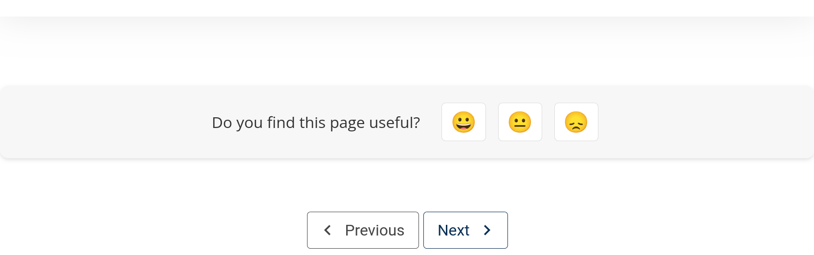
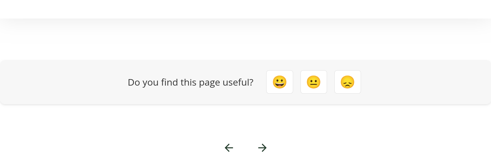

# Sequence Bottom Navigation Slot

### Slot ID: `org.openedx.frontend.learning.sequence_bottom_navigation.v1`

### Props:
* `sequenceId` (string) — Current sequence identifier
* `unitId` (string) — Current unit identifier
* `nextHandler` (function) — Handler for next navigation action
* `onNavigate` (function) — Handler for direct unit navigation
* `previousHandler` (function) — Handler for previous navigation action

## Description

This slot is used to replace/modify/hide the sequence navigation component that controls navigation between units within a course sequence at the bottom of the page.

## Example

### Default Navigation


### Replaced with top naviation arrows


```js
import { DIRECT_PLUGIN, PLUGIN_OPERATIONS } from '@openedx/frontend-plugin-framework';

const config = {
  pluginSlots: {
    'org.openedx.frontend.learning.sequence_bottom_navigation.v1': {
      keepDefault: false,
      plugins: [
        {
          op: PLUGIN_OPERATIONS.Insert,
          widget: {
            id: 'custom_sequence_navigation',
            type: DIRECT_PLUGIN,
            RenderWidget: ({
              sequenceId,
              unitId,
              nextHandler,
              onNavigate,
              previousHandler
            }) => {
              const { courseId } = useParams();
              return (
                <div className="d-flex justify-content-center align-items-center">
                  <UnitNavigation
                    courseId={courseId}
                    sequenceId={sequenceId}
                    unitId={unitId}
                    isAtTop={true}
                    onClickPrevious={previousHandler}
                    onClickNext={nextHandler}
                  />
                </div>
              );
            },
          },
        },
      ],
    },
  },
};

export default config;
```
