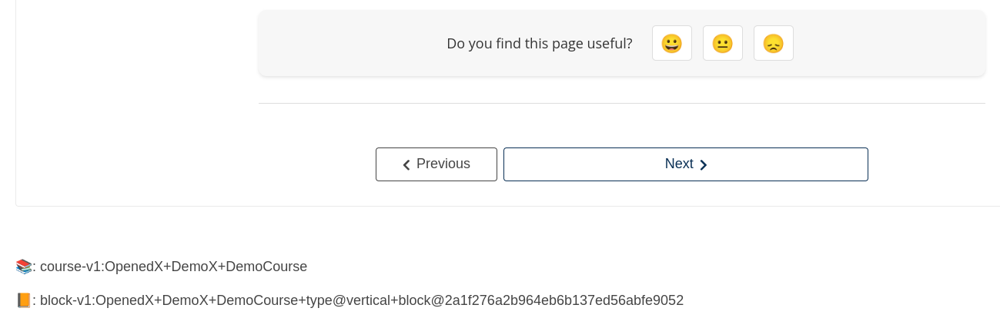

# Sequence Container Slot

### Slot ID: `sequence_container_slot`
### Props:
* `courseId`
* `unitId`

## Description

This slot is used for adding content after the Sequence content section.

## Example

The following `env.config.jsx` will render the `course_id` and `unit_id` of the course as `<p>` elements in a `<div>`.



```js
import { DIRECT_PLUGIN, PLUGIN_OPERATIONS } from '@openedx/frontend-plugin-framework';

const config = {
  pluginSlots: {
    sequence_container_slot: {
      plugins: [
        {
          // Insert custom content after sequence content
          op: PLUGIN_OPERATIONS.Insert,
          widget: {
            id: 'custom_sequence_container_content',
            type: DIRECT_PLUGIN,
            RenderWidget: ({courseId, unitId}) => (
              <div>
                <p>📚: {courseId}</p>
                <p>📙: {unitId}</p>
              </div>
            ),
          },
        },
      ]
    }
  },
}

export default config;
```
