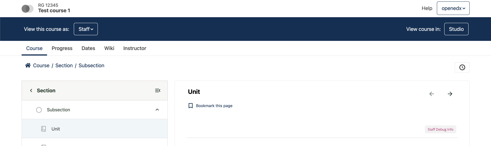
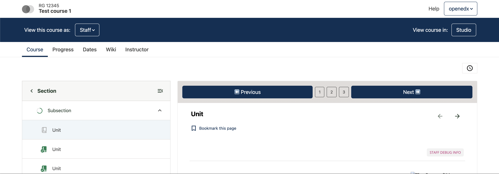

# Sequence Navigation Slot

### Slot ID: `org.openedx.frontend.learning.sequence_navigation.v1`

### Props:
* `sequenceId` (string) — Current sequence identifier
* `unitId` (string) — Current unit identifier
* `nextHandler` (function) — Handler for next navigation action
* `onNavigate` (function) — Handler for direct unit navigation
* `previousHandler` (function) — Handler for previous navigation action

## Description

This slot is used to replace/modify/hide the sequence navigation component that controls navigation between units within a course sequence.

## Example

### Default content


### Replaced with custom component


The following `env.config.jsx` will replace the sequence navigation with a custom implementation that uses all available props.

```js
import { DIRECT_PLUGIN, PLUGIN_OPERATIONS } from '@openedx/frontend-plugin-framework';

const config = {
  pluginSlots: {
    'org.openedx.frontend.learning.sequence_navigation.v1': {
      keepDefault: false,
      plugins: [
        {
          op: PLUGIN_OPERATIONS.Insert,
          widget: {
            id: 'custom_sequence_navigation',
            type: DIRECT_PLUGIN,
            RenderWidget: ({ sequenceId, unitId, nextHandler, onNavigate, previousHandler }) => {
              // Mock unit data for demonstration
              const units = ['unit-1', 'unit-2', 'unit-3'];

              return (
                <Stack gap={2} direction="horizontal" className="p-3 bg-light w-100">
                  <Button
                    className="flex-grow-1"
                    onClick={previousHandler}
                  >
                    ⬅️ Previous
                  </Button>
                  <Stack gap={2} direction="horizontal">
                    {units.map((unit, index) => (
                      <Button
                        variant="outline-primary"
                        key={unit}
                        className={`btn btn-sm ${unitId === unit ? 'btn-primary' : 'btn-outline-secondary'}`}
                        onClick={() => onNavigate(unit)}
                      >
                        {index + 1}
                      </Button>
                    ))}
                  </Stack>
                  <Button
                    className="flex-grow-1"
                    onClick={nextHandler}
                  >
                    Next ➡️
                  </Button>
                </Stack>
              )
            },
          },
        },
      ]
    }
  },
}

export default config;
```
