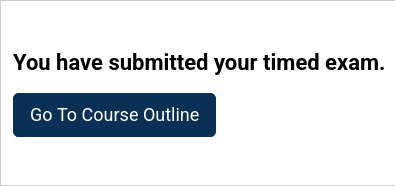

# Submitted Timed Exam Instructions Slot

### Slot ID: `org.openedx.frontend.special_exams.submitted_timed_exam_instructions.v1`

### Props:
* `timeIsOver` - Boolean indicating whether the exam time limit has been exceeded. This allows plugins to render
different content based on whether the submission was made within the time limit or after time expired.

## Description

This slot allows for the customization of the instructions displayed after a timed exam is submitted. It is
rendered by `@edx/frontend-lib-special-exams` through `SequenceExamWrapper`'s `submittedTimedExamInstructions` prop.

## Examples

### Default content


### Modify the message

This example shows how to modify the default messages.


```javascript
import { DIRECT_PLUGIN, PLUGIN_OPERATIONS } from '@openedx/frontend-plugin-framework';

const config = {
  pluginSlots: {
    'org.openedx.frontend.special_exams.submitted_timed_exam_instructions.v1': {
      keepDefault: false,
      plugins: [{
        op: PLUGIN_OPERATIONS.Insert,
        widget: {
          id: 'custom_messages',
          type: DIRECT_PLUGIN,
          priority: 1,
          RenderWidget: ({ timeIsOver }) => (
            <h3 className="h3" data-testid="exam.submittedExamInstructions.title">
              {timeIsOver ? (
                <span>Time's up! Your exam has been submitted for review.</span>
              ) : (
                <span>Great job! Your exam submission was successful.</span>
              )}
            </h3>
          ),
        },
      }],
    },
  },
};

export default config;
```

### Add a Course Outline button

This example shows how to add a "Go To Course Outline" button while keeping the default instructions.



```javascript
import { getConfig } from '@edx/frontend-platform';
import { DIRECT_PLUGIN, PLUGIN_OPERATIONS } from '@openedx/frontend-plugin-framework';
import { Button } from '@openedx/paragon';
import { useParams } from 'react-router-dom';

const config = {
  pluginSlots: {
    'org.openedx.frontend.special_exams.submitted_timed_exam_instructions.v1': {
      keepDefault: true,
      plugins: [{
        op: PLUGIN_OPERATIONS.Insert,
        widget: {
          id: 'course_outline_button',
          type: DIRECT_PLUGIN,
          priority: 51,
          RenderWidget: () => {
            const { courseId } = useParams();
            const courseOutlineUrl = `${getConfig().LMS_BASE_URL}/courses/${courseId}/course/`;

            return (
              <div className="mt-3">
                <Button
                  href={courseOutlineUrl}
                  className="btn btn-primary"
                  data-testid="go-to-course-outline-link"
                >
                  Go To Course Outline
                </Button>
              </div>
            );
          },
        },
      }],
    },
  },
};

export default config;
```
