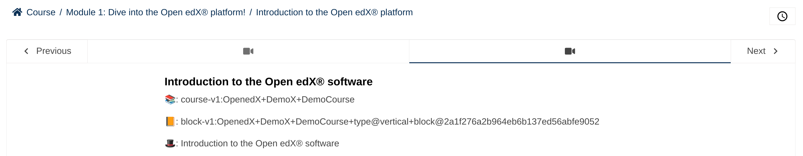

# Unit Title Slot

### Slot ID: `unit_title_slot`
### Props:
* `courseId`
* `unitId`
* `unitTitle`

## Description

This slot is used for adding content after the Unit title.

## Example

The following `env.config.jsx` will render the `course_id`, `unit_id` and `unitTitle` of the course as `<p>` elements.



```js
import { DIRECT_PLUGIN, PLUGIN_OPERATIONS } from '@openedx/frontend-plugin-framework';

const config = {
  pluginSlots: {
    unit_title_slot: {
      plugins: [
        {
          // Insert custom content after unit title
          op: PLUGIN_OPERATIONS.Insert,
          widget: {
            id: 'custom_unit_title_content',
            type: DIRECT_PLUGIN,
            RenderWidget: ({courseId, unitId, unitTitle}) => (
              <>
                <p>📚: {courseId}</p>
                <p>📙: {unitId}</p>
                <p>📙: {unitTitle}</p>
              </>
            ),
          },
        },
      ]
    }
  },
}

export default config;
```
