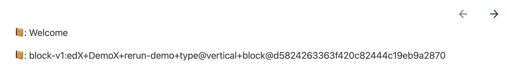

# Unit Title Slot

### Slot ID: `unit_title_slot`
### Props:
* `unitId`
* `unit`
* `isEnabledOutlineSidebar`
* `renderUnitNavigation`

## Description

This slot is used for adding content before or after the Unit title.

## Example

The following `env.config.jsx` will render `unit_id` and `unitTitle` of the course as `<p>` elements.



```js
import { DIRECT_PLUGIN, PLUGIN_OPERATIONS } from '@openedx/frontend-plugin-framework';

const config = {
  pluginSlots: {
    unit_title_slot: {
      plugins: [
        {
          // Insert custom content after unit title
          op: PLUGIN_OPERATIONS.Insert,
          widget: {
            id: 'custom_unit_title_content',
            type: DIRECT_PLUGIN,
            RenderWidget: ({ unitId, unit, isEnabledOutlineSidebar, renderUnitNavigation }) => (
              <>
                {isEnabledOutlineSidebar && renderUnitNavigation(true)}
                <p>📙: {unit.title}</p>
                <p>📙: {unitId}</p>
              </>
            ),
          },
        },
      ]
    }
  },
}

export default config;
```
